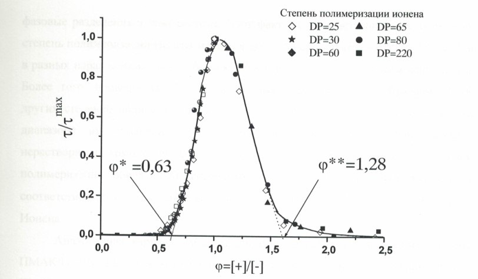
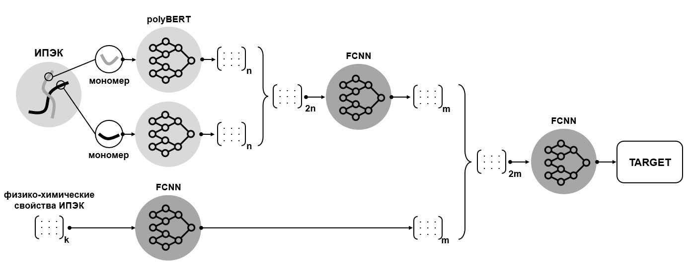
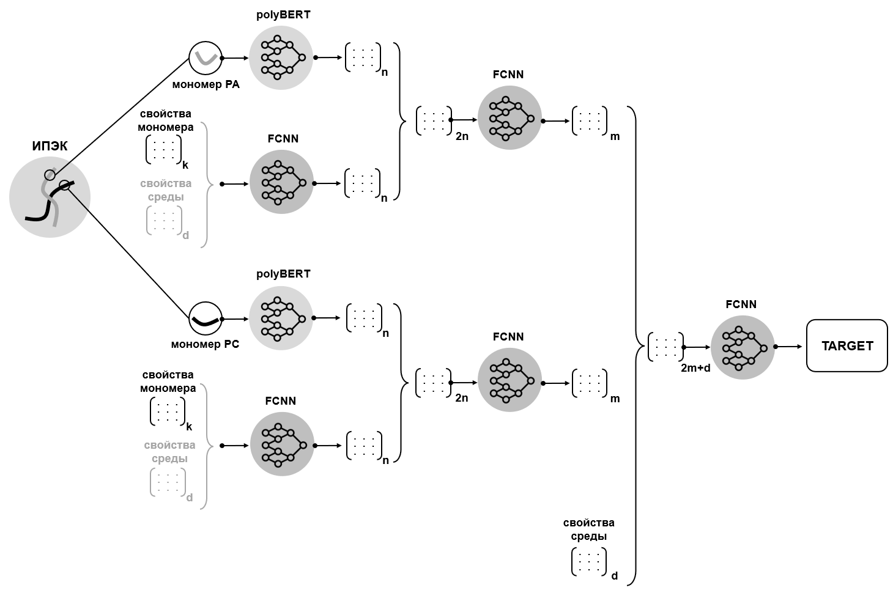
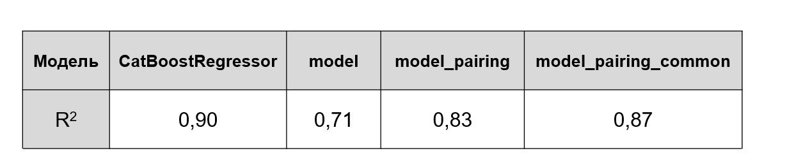

# IPEC_net - The world's first model for predicting the area of existence of water-soluble interpolyelectrolyte complexes for solving biomedical problems

This work is devoted to the development of the world's first machine learning-based model for predicting the area of existence of water-soluble interpolyelectrolyte complexes for solving biomedical problems. A new approach is proposed that takes into account both the physico-chemical properties of polyelectrolytes and the chemical structures of their monomeric units. The developed approach is universal and can be used to predict the properties of multicomponent systems of a different chemical nature. The results of the work were applied to select the optimal composition of interpolyelectrolyte complexes for various environmental conditions in order to create bactericidal coatings.

# Aim and tasks
The purpose of this work is to develop a predictive model for determining the stability range of interpolyelectrolyte complexes formed by various pairs of polyelectrolytes depending on environmental conditions. The creation of such a model will reduce the selection time of the IPEC composition for solving scientific and applied problems and identify the key factors influencing their formation.

Tasks:
1. Preprocess data
2. Develop a neural network to predict the target property 
3. Compare approaches based on classical machine learning and deep learning
4. Analyze the importance of the physico-chemical properties of polyelectrolytes on the formation of a water-soluble complex

# Data
The data on the phase stability of IPEC are the curves of turbidimetric titration, a method for measuring the intensity of the luminous flux passing through a solution containing suspended particles. An increase in the turbidity of the solution indicates the formation of aggregates caused by the phase separation of the IPEC. As an indicator of the stable existence of a polyelectrolyte complex, according to the approach developed in the field, the critical value of the molar charge ratio of lyophilizing (in excess of molar ratios of links) to blocking (in short supply) polymers was chosen  - the value of phi* in the graph below.

Fig.1 Dependence of relative turbidity of mixtures of solutions 
PAK\o and Ionine of various degrees of polymerization depend on the composition of the mixture.  Smas=0.005 M; 
Slpe=4*10“M, pH=9.0, 25°C

The dataset consists of 269 pairs – polyanion/ polycation pairs with known physico-chemical properties of monomers, the chemical formula of the monomer link, synthesis conditions and target parameters – indicators of the stable existence of the polyelectrolyte complex.  The physicochemical properties of polyelectrolytes were partially obtained from the chemical structure of monomers using the rdkit.Chem library.Descriptors.

# Models
The polyBERT transformer model was used as a basis for creating polymer fingerprints based on the structure of their monomer units [21]. This model is used to predict the properties of polymers based on their structure, as well as to generate new potentially synthesizable polymers based on specified properties. At the moment, polyBERT is the most advanced model for creating polymer embeddings. polyBERT accepts the monomer structure in canonical form, the so-called pSMILES, and provides embedding at the output.
To solve our problem, the following several models have been developed and studied.

1) The embeddings of each polymer created using polyBERT are concatenated and passed through a fully connected layer to reduce dimensionality. The normalized physico-chemical features of polymers are also passed through a fully connected layer to obtain embedding of the same dimension as the embeddings of structures. Next, both representations are concatenated and passed through the third fully connected layer, at the output of which we get a normalized target.
The qualitative structure of the network is shown in the graph below

A model was also studied in which the physico-chemical features of each polymer were concatenated in pairs with embedding of the chemical structure of the monomer.

2) The normalized physico-chemical features of each polymer were passed through a fully bonded layer and concatenated with embedding of each polymer created using polyBERT. Then the generalized embedding of each polymer was passed through another fully connected layer and concatenated with the embedding of another polymer at the output. A vector consisting of the remaining features characterizing the environment in which the formation of IPEC occurs was added to the combined embedding. The final vector was again passed through fully connected layers, at the output of which a normalized target was obtained. The qualitative structure of the network is shown in the graph below

# Results
PAK \ HDPE and ionine 3,3 bromide \ MAC were included in the test sample as the most in demand in the field of creating bactericidal coatings.

Of great interest are the results obtained using deep learning models created on the basis of an algorithm for working with multiparametric chemical problems developed during the solution of the problem. Three approaches have been proposed and investigated to account for both the physico-chemical properties of polymers and to account for their structure. 

1) ML-approach
   
The list of selected predicted features [PA_BalabanJ, PS_fr_Ndealkylation1, PA_EState_VSA7, PS_SlogP_VSA4, PS_SMR_VSA4, PA_SMR_VSA5, PS_fr_unbrch_alkane, PA_SPS, PA_VSA_EState8, PS_qed, PA_DP, PC_DP, NaCl, PA_idx, PC_idx, eps , eps1, eps2] allows us to identify some features of the formation of IPEC. Firstly, both components of the system have an impact on the formation of the complex, and not mainly an excess polymer, as was assumed under the initial hypothesis. Secondly, the initial assumption about the importance of the properties of the medium for the formation of IPEC, in particular the ionic strength of the solution, as well as the ratio of the degrees of polymerization of the components, was confirmed.

Code is available on IPEC_ML.ipynb

2) model.py

The first model, created on the basis of combining vectors of all features and the general embedding of polymer structures obtained using polyBERT, demonstrated results significantly inferior to those obtained using classical ML approaches. This result may be due to the small amount of data available for training, as well as the need to take into account the properties of each component of the system when training independently.

3) model_pairing.py  
4) model_pairing_common.py

From this point of view, the second (model_pairing) and third (model_pairing_common) models, created on the basis of an independent presentation of the characteristics of each polymer, showed more outstanding results, only slightly inferior to the approaches of classical ML. Thus, it is possible to make an assumption about the prospects of the proposed approach when working with multicomponent chemical systems. This approach has a number of advantages: the possibility of modification, the absence of the need for feature selection, as well as the potential to improve quality when expanding the data set.

# Usage and dependencies

ML-approach IPEC_ML.ipynb.
DL-approach IPEC_DL.ipynb

Launch these notebooks in google colab.
The project was done with Python 3.8.5

# Literature

[1] Lankalapalli S, Kolapalli VR. Polyelectrolyte Complexes: A Review of their Applicability in Drug Delivery Technology. Indian J Pharm Sci. 2009 Sep;71(5):481-7. doi: 10.4103/0250-474X.58165. PMID: 20502564; PMCID: PMC2866337.

[2] Pigareva V.A., Bol’shakova A.V., Marina V.I., Sybachin A.V., Water-Soluble Interpolyelectrolyte Complex Based on Poly(diallyldimethylammonium chloride) and Sodium Polyacrylate as a Component for Creating Stable Biocidal Coatings // Colloid Journal, Vo.85, N.3, p.441, 2023

[3] Giaouri, E., Heir, E., Desvaux, M., et al., Intra- and inter-species interactions within biofilms of important foodborne bacterial pathogens, Front. Microbiol., 2015, vol. 6, p. 841.

[4] Carrascosa, C., Raheem, D., Ramos, F., et al., Microbial biofilms in the food industry-A comprehensive review, Int. J. Environ. Res. Public Health, 2021, vol. 18, no. 4. p. 2014.

[5] Panova, I., Drobyazko, A., Spiridonov, V., Sybachin, A., Kydralieva, K., Jorobekova, S., and Yaroslavov, A., Humics-based interpolyelectrolyte complexes for antierosion protection of soil: Model investigation, Land Degradation and Development, 2019, vol. 30, p. 337.

[6] Chen, C., Illergård, J., Wågberg, L., and Ek, M., Effect of cationic polyelectrolytes in contact-active antibacterial layer-by-layer functionalization, Holzforschung, 2017, vol. 71, nos. 7–8, p. 649.

[7] Kusaia, V.S., Kozhunova, E.Y., Stepanova, D.A., Pigareva, V.A., Sybachin, A.V., Zezin, S.B., Bolshakova, A.V., Shchelkunov, N.M., Vavaev, E.S., Lyubin, E.V., Fedyanin, A.A., and Spiridonov, V.V., Synthesis of magneto-controllable polymer nanocarrier based on poly(n-isopropylacrylamide-co-acrylic acid) for doxorubicin immobilization, Polymers, 2022, vol. 14, no. 24, p. 5440.

[8] Izumrudov, V.A. and Sybachin, A.V., Phase separation in solutions of polyelectrolyte complexes: The decisive effect of a host polyion, Polym. Sci., Ser. A, 2006, vol. 48, no. 10, p. 1098.

[9] Izumrudov, V.A., Paraschuk, V.V., and Sybachin, A.V., Controlled phase separations in solutions of polyelectrolyte complexes—Potential for gene delivery, J. Drug Delivery Sci. Technol., 2006, vol. 16, no. 4, p. 267.

[10] Kabanov, V.A., Physical and chemical foundations and prospects for the use of soluble interpolyelectrolyte complexes, Polym. Sci., 1994, vol. 36, no. 2, p. 183.

[11] Graph convolutional neural networks as general-purpose property predictors: the universality and limits of applicability / V. Korolev, A. Mitrofanov, A. Korotcov, V. Tkachenko // Journal of Chemical Information and Modeling. — 2020. — Vol. 60, no. 1. — P. 22–28.

[12] James E. Saal, Scott Kirklin, Muratahan Aykol, Bryce Meredig, and C. Wolverton. Materials design and discovery with high-throughput density functional theory: The open quantum materials database (OQMD). Jom, 65(11):1501–1509, 2013.

[13] Anubhav Jain, Shyue Ping Ong, Geoffroy Hautier, Wei Chen, William Davidson Richards, Stephen Dacek, Shreyas Cholia, Dan Gunter, David Skinner, Gerbrand Ceder, and Kristin A. Persson. Commentary: The materials project: A materials genome approach to accelerating materials innovation. APL Materials, 1(1), 2013.

[14] John B O Mitchell. Machine learning methods in chemoinformatics. Wiley Interdisciplinary Reviews: Computational Molecular Science, 4(5):468–481, 2014

[15] Rampi Ramprasad, Rohit Batra, Ghanshyam Pilania, Arun Mannodi-Kanakkithodi, and Chiho Kim. Machine learning in materials informatics: Recent applications and prospects. npj Computational Materials, 3(1):1–27, 2017.

[16] Jose´ Garc´ıa de la Torre, Jose´ G Hern and M Carmen Lopez Mart´ınez Prediction of solution properties of flexible-chain polymers // Eur. J. Phys. 29 (2008) 945–956 

[17] Varvara Gribova, Anastasiia Navalikhina, Oleksandr Lysenko at al. Prediction of coating thickness for polyelectrolyte multilayers via machine learning // Scientific Reports | (2021) 11:18702

[18] Spyridon Koutsoukos, Frederik Philippi at al. A review on machine learning algorithms for the ionic liquid chemical space // Chem. Sci., 2021, 12, 6820–6843

[19] Sergey V. Larin, Dmitry V. Pergushov. Nano-patterned structures in cylindrical polyelectrolyte brushes assembled with oppositely charged polyions // Soft Matter, 2009, 5, 4938–4943 

[20]  Ishizu, K.; Toyoda, K.; Furukawa, T.; Sogabe, A. // Macromolecules 2004,37, 3954–3957.

[21] Kuenneth, C., Ramprasad, R. polyBERT: a chemical language model to enable fully machine-driven ultrafast polymer informatics. Nat Commun 14, 4099 (2023). https://doi.org/10.1038/s41467-023-39868-6
